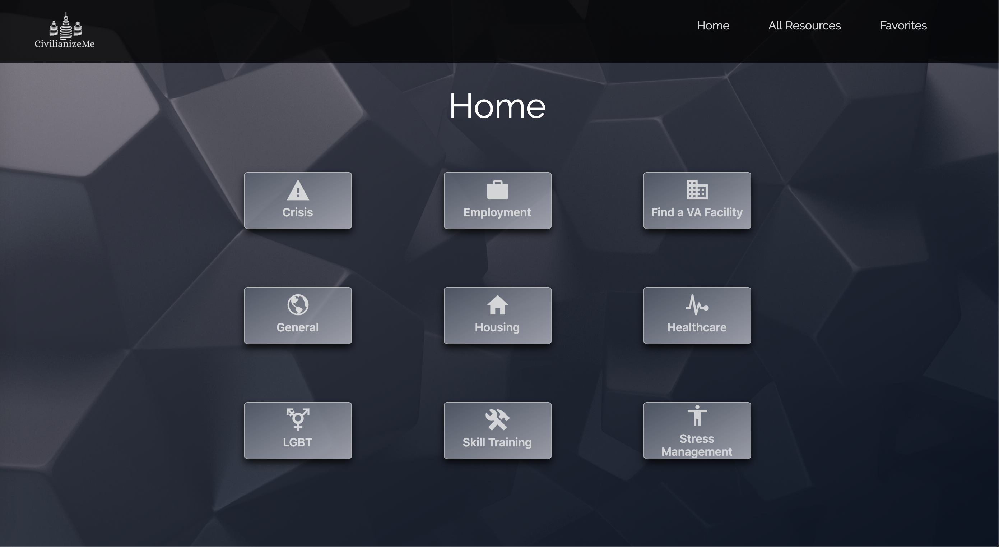

# civilianize-me-FE
The front end repository for the CivilianizeMe App.

Deployed at: https://syntheticautomation.github.io/civilianize-me-FE/home.html

## Design

The UX was designed specifically for military veterans. Visibility was tested in different screen exposures to sunlight to determine the optimal color pallate. The white text on the graphite buttons allows users to see the crisis button and all of their resources even when a screen is facing directly at the sun (though we would not recommend using the site this way). We believe this will be helpful in situations where users have vision impairment or are using the app outside. Though this feature might seem insignificant, there are many homeless veterans, so we feel that testing for outdoor use was a necessary design integration to this project.

Other UX implementations:
-After surveying some veteran friends of ours, we got some good ideas about what to avoid and what to pursue with the design. We gathered that the general consensus was that the majority of government websites vets use have almost no front end design other than basic formatting and huge blocks of text. Veterans come out of the military and are expected to read hundreds of pages of online articles about how to apply, submit, and get access to various resources. We wanted to counter this by having a very simplified view that makes the resource finding process as short as humanly possible. We also gathered that there was a general overexposure to military images, such as the red/white/blue theme, unforms, vehicles, weapons, and more. Our design avoids this entirely to give the veteran mind a soothing break but still have that "security vault" feel.

## Setup

To access this repository locally, clone the repository by entering this in your shell:

`git clone https://github.com/SyntheticAutomation/civilianize-me-FE.git`

run `npm install && npm install node-sass`

start up a new terminal and navigate to the same directory. run `npm run compile:sass` to track changes to styling if you are making them. it will compile all the scss into a single css file for you.

## How to Use

This app is built to provide veterans with industry-tested, data-driven resources and minimize the amount of time it takes to access them. Too often veterans come home from deployment and are given essentially an online encyclopedia of information to sift through online. Furthermore, there is a catastrophic amount of homeless veterans. Although it is on a snail-like decline, we can still facilitate a better quality of life for the people who have risked theirs for us.

Veterans can currently use the crisis and employment resource pages. The other pages are non functional and will require further development. We created our own list of resources via research, speaking with the crisis line, and getting feedback from many veterans themselves. We gathered what worked for them, and what has worked over the phone for crisis counselors. The resources found on this page provide veterans with tremendously increased access to benefits.

## Future Iterations

Many features are yet to be built or integrated to the app. Future iterations that we have considered:

- The remainder of the buttons

- Advanced front-end interaction and animations to make navigating the app a soothing experience without sacrificing efficiency of resource access.

- Integration with the VA's proprietary OAuth called ConnectID, which would open up the ability to send medical documents and access healthcare information. In some cases, maybe in the near future, even schedule an appointment. This feature would tremendously cut down on visits to the VA which would improve the VA's ability to handle high volume, and save vets requiring transportation, bypassing a trip to the facility and waiting in line. 

- Timers for loss of access

- Communication Portal for a Transitional Care Team or Psychiatrist

- Discharge date on a Profile page using the VA's API as it further develops

- Nearest CRRC (Community Resource and Referral Center) based on Geocode information

- Asking user for location permission

- "Inner Strength" section that has a journal, encryption, a mental health exercise, and the call line numbers like VCL and Military OneSource

- Blind users can navigate the app

- Responsive styling checks

- [Benefits Intake](https://developer.va.gov/explore/benefits/docs/benefits) - users can submit PDF forms and documents
- [Appeals Status](https://developer.va.gov/explore/benefits/docs/appeals) - users can track appeals
- [Benefits Claims](https://developer.va.gov/explore/benefits/docs/claims) - users can check the status of a submitted claim and upload for 526 or supporting documents for form 526.

- ####Security Configurations that address OWASP Top 10:
- DDoS
    - Use Rack::Attack to prevent bots from wasting bandwidth
    - Integrate CloudFlare
- Injections
    - input sanitization
    - parameterized queries
    - safe APIs
- Broken Authentication
    - multifactor auth
    - session isolation
    - idle session timeouts
    - secured cookies
- Sensitive Data exposure
    - recommend users use the chrome extension HTTPEverywhere
    - encrypt all data in transit and at rest
    - use only secure protocols and algorithms
    - disable caching of responses with sensitive data
- XML External Entities
    - remove serialization of sensitive data
    - implement whitelisting approach (server side) to prevent malicious XML upload
    - use WAF to detect and block XXE
    - automated community requests for code reviews
- Broken Access Control
    - invalidate tokens & cookies after logout
    - force login/logout after a password change
    - server-side resource restriction (i.e. directories)
- Security misconfigurations
    - regular runs of Brakeman
    - ensure there aren't any unused gems or framework features installed
- XSS (cross-site scripting)
    - enable CSP (content-security policy)
    - output encoding and escaping untrusted characters
    - JS files encrypted variables and minification/concatenated
- Insecure Deserialization
    - encrypt serialized data
    - deserializers run with the least privileges possible

--------------------------------------------------------------------------------

## Front End Features

- UX specifically for vets

- Rapid load times & front end optimization

- API Consumption

- SCSS integration and NPM scripting

## Known Issues
- As junior devs, we know there is a better way to do the API calls that doesn't require an async/await delay and we are curious what that would look like.

- The SCSS files need to be formatted, refactored, and code should be placed in its respective directory rather than bulking components with font formatting, for example.

## Project Management
Agile Board: https://trello.com/b/0K6Gcufg/civilianizeme

RIP Waffle!!! (May 16 2019)

## Design/Features
This project uses the following design principles & strategies:

- CSS
    - 7-1 Architecture
    - SCSS Syntax
    - Custom Animations
    - Advanced Built-in Animations: translate, scale and more
    - Custom CSS Grid

- JavaScript
    - Async / Await 
    - API Fetch
    - Hoisting

## Tools & Technologies
- HTML5
- CSS3
- CSS Grid
- CSS Flexbox
- Sass/SCSS
- Vanilla JavaScript, ES5 & ES6
- Iconicons
- jQuery

## Preview

